# CONTENTS:

* 01 天天写CRUD，你知道你的系统是如何跟MySQL打交道的吗？
* 02 为了执行SQL语句，你知道MySQL用了什么样的架构设计吗？
* 03 用一次数据更新流程，初步了解InnoDB存储引擎的架构设计
* 04 借着更新语句在InnoDB存储引擎中的执行流程，聊聊binlog是什么？
* 05 生产经验：真实生产环境下的数据库机器配置如何规划？
* 06 生产经验：互联网公司的生产环境数据库是如何进行性能测试的？
* 07 生产经验：如何对生产环境中的数据库进行360度无死角压测？
* 08 生产经验：在数据库的压测过程中，如何360度无死角观察机器性能？
* 09 生产经验：如何为生产环境中的数据库部署监控系统？
* 10 生产经验：如何为数据库的监控系统部署可视化报表系统？
* 11 从数据的增删改开始讲起，回顾一下Buffer Pool在数据库里的地位
* 12 Buffer Pool这个内存数据结构到底长个什么样子？
* 13 从磁盘读取数据页到Buffer Pool的时候，free链表有什么用？
* 14 当我们更新Buffer Pool中的数据时，flush链表有什么用？
* 15 当Buffer Pool中的缓存页不够的时候，如何基于LRU算法淘汰部分缓存？
* 16 简单的LRU链表在Buffer Pool实际运行中，可能导致哪些问题？
* 17 MySQL是如何基于冷热数据分离的方案，来优化LRU算法的？
* 18 基于冷热数据分离方案优化后的LRU链表，是如何解决之前的问题的？
* 19 MySQL是如何将LRU链表的使用性能优化到极致的？
* 20 对于LRU链表中尾部的缓存页，是如何淘汰他们刷入磁盘的？
* 21 生产经验：如何通过多个Buffer Pool来优化数据库的并发性能？
* 22 生产经验：如何通过chunk来支持数据库运行期间的Buffer Pool动态调整？
* 23 生产经验：在生产环境中，如何基于机器配置来合理设置Buffer Pool？
* 24 我们写入数据库的一行数据，在磁盘上是怎么存储的？
* 25 对于VARCHAR这种变长字段，在磁盘上到底是如何存储的？
* 26 一行数据中的多个NULL字段值在磁盘上怎么存储？
* 27 磁盘文件中， 40个bit位的数据头以及真实数据是如何存储的？
* 28 我们每一行的实际数据在磁盘上是如何存储的？
* 29 理解数据在磁盘上的物理存储之后，聊聊行溢出是什么东西？
* 30 用于存放磁盘上的多行数据的数据页到底长个什么样子？
* 31 表空间以及划分多个数据页的数据区，又是什么概念？
* 32 一文总结初步了解到的MySQL存储模型以及数据读写机制
* 33 MySQL数据库的日志顺序读写以及数据文件随机读写的原理
* 34 生产经验：Linux操作系统的存储系统软件层原理剖析以及IO调度优化原理
* 35 生产经验：数据库服务器使用的RAID存储架构初步介绍
* 36 生产经验：数据库服务器上的RAID存储架构的电池充放电原理
* 37 案例实战：RAID锂电池充放电导致的MySQL数据库性能抖动的优化
* 38 案例实战：数据库无法连接故障的定位，Too many connections
* 39 案例实战：如何解决经典的Too many connections故障？背后原理是什么
* 40 重新回顾redo日志对于事务提交后，数据绝对不会丢失的意义
* 41 在Buffer Pool执行完增删改之后，写入日志文件的redo log长什么样？
* 42 redo log是直接一条一条写入文件的吗？非也，揭秘redo log block！
* 43 直接强行把redo log写入磁盘？非也，揭秘redo log buffer！
* 44 redo log buffer中的缓冲日志，到底什么时候可以写入磁盘？
* 45 如果事务执行到一半要回滚怎么办？再探undo log回滚日志原理！
* 46 一起来看看INSRET语句的undo log回滚日志长什么样？
* 47 简单回顾一下， MySQL运行时多个事务同时执行是什么场景？
* 48 多个事务并发更新以及查询数据，为什么会有脏写和脏读的问题？
* 49 一个事务多次查询一条数据读到的都是不同的值，这就是不可重复读？
* 50 听起来很恐怖的数据库幻读，到底是个什么奇葩问题？
* 51 SQL标准中对事务的4个隔离级别，都是如何规定的呢？
* 52 MySQL是如何支持4种事务隔离级别的？Spring事务注解是如何设置的？
* 53 理解MVCC机制的前奏：undo log版本链是个什么东西？
* 54 基于undo log多版本链条实现的ReadView机制，到底是什么？
* 55 Read Committed隔离级别是如何基于ReadView机制实现的？
* 56 MySQL最牛的RR隔离级别，是如何基于ReadView机制实现的？
* 57 停一停脚步：梳理一下数据库的多事务并发运行的隔离机制
* 58 多个事务更新同一行数据时，是如何加锁避免脏写的？
* 59 对MySQL锁机制再深入一步，共享锁和独占锁到底是什么？
* 60 在数据库里，哪些操作会导致在表级别加锁呢？
* 61 表锁和行锁互相之间的关系以及互斥规则是什么呢？
* 62 案例实战：线上数据库不确定性的性能抖动优化实践（上）
* 63 案例实战：线上数据库莫名其妙的随机性能抖动优化（下）
* 64 深入研究索引之前，先来看看磁盘数据页的存储结构
* 65 假设没有任何索引，数据库是如何根据查询语句搜索数据的？
* 66 不断在表中插入数据时，物理存储是如何进行页分裂的？
* 67 基于主键的索引是如何设计的，以及如何根据主键索引查询？
* 68 索引的页存储物理结构，是如何用B+树来实现的？
* 69 更新数据的时候，自动维护的聚簇索引到底是什么？
* 70 针对主键之外的字段建立的二级索引，又是如何运作的？
* 71 插入数据时到底是如何维护好不同索引的B+树的？
* 72 一个表里是不是索引搞的越多越好？那你就大错特错了！
* 73 通过一步一图来深入理解联合索引查询原理以及全值匹配规则
* 74 再来看看几个最常见和最基本的索引使用规则
* 75 当我们在SQL里进行排序的时候，如何才能使用索引？
* 76 当我们在SQL里进行分组的时候，如何才能使用索引？
* 77 回表查询对性能的损害以及覆盖索引是什么？
* 78 设计索引的时候，我们一般要考虑哪些因素呢？（上）
* 79 设计索引的时候，我们一般要考虑哪些因素呢？（中）
* 80 设计索引的时候，我们一般要考虑哪些因素呢？（下）
* 81 案例实战：陌生人社交APP的MySQL索引设计实战（一）
* 82 案例实战：陌生人社交APP的MySQL索引设计实战（二）
* 83 案例实战：陌生人社交APP的MySQL索引设计实战（3）
* 84 案例实战：陌生人社交APP的MySQL索引设计实战（4）
* 85 提纲挈领的告诉你，SQL语句的执行计划和性能优化有什么关系？
* 86 以MySQL单表查询来举例，看看执行计划包含哪些内容（1）？
* 87 以MySQL单表查询来举例，看看执行计划包含哪些内容（2）？
* 88 再次重温写出各种SQL语句的时候，会用什么执行计划？（1）
* 89 再次重温写出各种SQL语句的时候，会用什么执行计划？（2）
* 90 再次重温写出各种SQL语句的时候，会用什么执行计划？（3）
* 91 深入探索多表关联的SQL语句到底是如何执行的？（1）
* 92 深入探索多表关联的SQL语句到底是如何执行的？（2）
* 93 深入探索多表关联的SQL语句到底是如何执行的？（3）
* 94 MySQL是如何根据成本优化选择执行计划的？（上）
* 95 MySQL是如何根据成本优化选择执行计划的？（中）
* 96 MySQL是如何根据成本优化选择执行计划的？（下）
* 97 MySQL是如何基于各种规则去优化执行计划的？（上）
* 98 MySQL是如何基于各种规则去优化执行计划的？（中）
* 99 MySQL是如何基于各种规则去优化执行计划的？（下）
* 100 透彻研究通过explain命令得到的SQL执行计划（1）
* 101 透彻研究通过explain命令得到的SQL执行计划（2）
* 102 透彻研究通过explain命令得到的SQL执行计划（3）
* 103 透彻研究通过explain命令得到的SQL执行计划（4）
* 104 透彻研究通过explain命令得到的SQL执行计划（5）
* 105 透彻研究通过explain命令得到的SQL执行计划（6）
* 106 透彻研究通过explain命令得到的SQL执行计划（7）
* 107 透彻研究通过explain命令得到的SQL执行计划（8）
* 108 透彻研究通过explain命令得到的SQL执行计划（9）
* 109 案例实战：千万级用户场景下的运营系统SQL调优（1）
* 110 案例实战：千万级用户场景下的运营系统SQL调优（2）
* 111 案例实战：千万级用户场景下的运营系统SQL调优（3）
* 112 案例实战：亿级数据量商品系统的SQL调优实战（1）
* 113 案例实战：亿级数据量商品系统的SQL调优实战（2）
* 114 案例实战：亿级数据量商品系统的SQL调优实战（3）
* 115 案例实战：数十亿数量级评论系统的SQL调优实战（1）
* 116 案例实战：千万级数据删除导致的慢查询优化实践（1）
* 117 案例实战：千万级数据删除导致的慢查询优化实践（2）
* 118 我们为什么要搭建一套MySQL的主从复制架构？（1）
* 119 我们为什么要搭建一套MySQL的主从复制架构？（2）
* 120 案例实战：千万级数据删除导致的慢查询优化实践（3）
* 121 如何为MySQL搭建一套主从复制架构？（1）
* 122 如何为MySQL搭建一套主从复制架构？（2）
* 123 如何为MySQL搭建一套主从复制架构？（3）
* 124 主从复制架构中的数据延迟问题，应该如何解决？
* 125 数据库高可用：基于主从复制实现故障转移（1）
* 126 数据库高可用：基于主从复制实现故障转移（2）
* 127 数据库高可用：基于主从复制实现故障转移（3）
* 128 案例实战：大型电商网站的上亿数据量的用户表如何进行水平拆分？
* 129 案例实战：一线电商公司的订单系统是如何进行数据库设计的？
* 130 案例实战：下一个难题，如果需要进行垮库的分页操作，应该怎么来做？
* 131 案例实战：当分库分表技术方案运行几年过后，再次进行扩容应该怎么做？
* 132 专栏总结：撒花庆祝大家对数据库技术的掌握更进一步


## 01 天天写CRUD，你知道你的系统是如何跟MySQL打交道的吗？

**1、Java工程师眼中的数据库是什么东西？**

从今天开始，我们将要开始一个MySQL的专栏，一起来研究MySQL数据库的底层原理和各种实践案例，以及互联网公司的技术方案。

现在我们先来看看，在一个Java工程师眼中的数据库是什么东西？

平时我们在做Java系统时，一般情况下都会连接到一个MySQL数据库上去，执行各种增删改查的语句。

据我所知，目前行业里大部分的Java工程师对MySQL的了解和掌握程度，大致就停留在这么一个阶段：对MySQL可以建库建表建索引，然后就是执行增删改查去更新和查询里面的数据！

所以我们看下面的图，很多Java工程师眼中的数据库大致就是下面这样子。

（**附加说明**：我在写《从0开始带你成为JVM实战高手》专栏时，采用的是亿图图示这个画图工具，现在为了统一画图风格，本专栏会改成《从0开始带你成为消息中间件实战高手》专栏一样的画图工具）    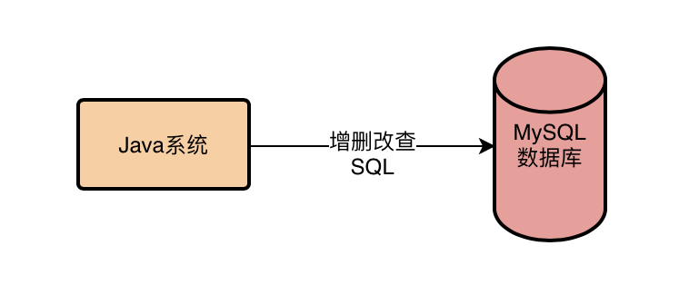

但是实际在使用MySQL的过程中，大家总会遇到这样那样的一些问题，比如死锁异常、SQL性能太差、异常报错，等等。

很多Java工程师在遇到MySQL数据库的一些问题时，一般都会上网搜索博客，然后自己尝试捣鼓着解决一下，最后解决了问题，自己可能也没搞明白里面的原理。

因此我们就是要带着大家去探索MySQL底层原理的方方面面，以及探索在解决MySQL各种生产实战问题的时候，如何基于MySQL底层原理去进行分析、排查和定位。

**2、MySQL驱动到底是什么东西？**

大家都知道，我们如果要在Java系统中去访问一个MySQL数据库，必须得在系统的依赖中加入一个MySQL驱动，有了这个MySQL驱动才能跟MySQL数据库建立连接，然后执行各种各样的SQL语句。

那么这个MySQL驱动到底是个什么东西？

我们先来看下面的一段maven配置，这段maven配置中就引入了一个MySQL驱动。这里的mysql-connector-java就是面向Java语言的MySQL驱动。

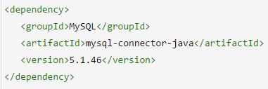

大家都知道，如果我们要访问数据库，必须得跟数据库建立一个网络连接，那么这个连接由谁来建立呢？

其实答案就是这个MySQL驱动，他会在底层跟数据库建立网络连接，有网络连接，接着才能去发送请求给数据库服务器！我们看下图。

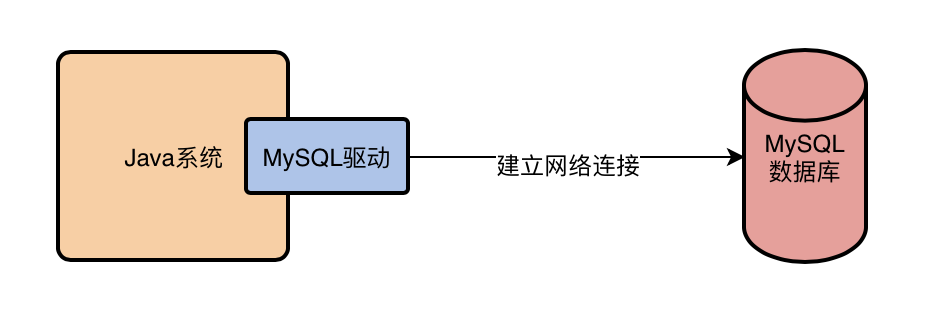

然后当我们跟数据库之间有了网络连接之后，我们的Java代码才能基于这个连接去执行各种各样的增删改查SQL语句

我们看下图

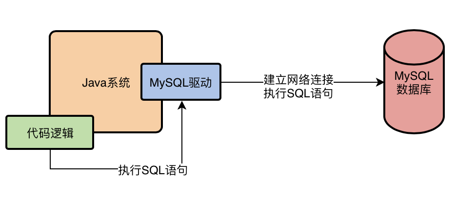

所以对于Java语言开发的系统，MySQL会提供Java版本的MySQL驱动，对于PHP、Perl、.NET、Python、Ruby等各种常见的编程语言，MySQL都会提供对应语言的MySQL驱动，让各种语言编写的系统通过MySQL驱动去访问数据库。

**3、数据库连接池到底是用来干什么的？**

接着我们来思考一个问题，一个Java系统难道只会跟数据库建立一个连接吗？

这个肯定是不行的，因为我们要明白一个道理，假设我们用Java开发了一个Web系统，是部署在Tomcat中的，那么Tomcat本身肯定是有多个线程来并发的处理同时接收到的多个请求的，我们看下图。

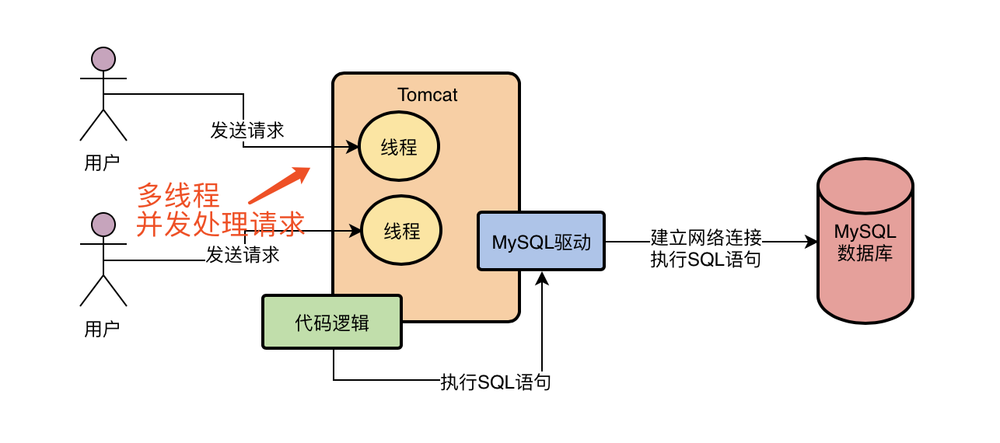

这个时候，如果Tomcat中的多个线程并发处理多个请求的时候，都要去抢夺一个连接去访问数据库的话，那效率肯定是很低下的

我们看下面的图

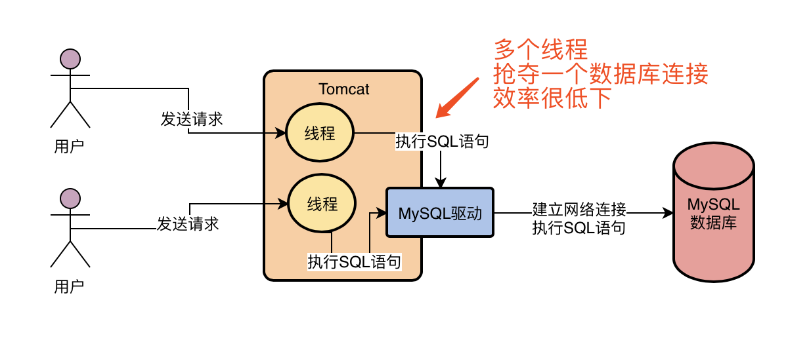
那么如果Tomcat中的每个线程在每次访问数据库的时候，都基于MySQL驱动去创建一个数据库连接，然后执行SQL语句，然后执行完之后再销毁这个数据库连接，这样行不行呢？

可能Tomcat中上百个线程会并发的频繁创建数据库连接，执行SQL语句，然后频繁的销毁数据库连接。

上述这个过程反复循环执行，大家觉得可行吗？

这也是非常不好的，因为每次建立一个数据库连接都很耗时，好不容易建立好了连接，执行完了SQL语句，你还把数据库连接给销毁了，下一次再重新建立数据库连接，那肯定是效率很低下的！如下图。

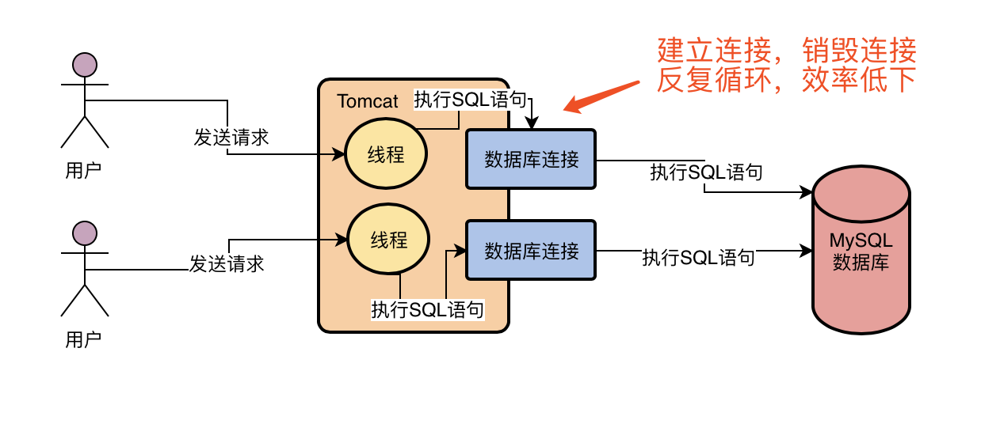
所以一般我们必须要使用一个数据库连接池，也就是说在一个池子里维持多个数据库连接，让多个线程使用里面的不同的数据库连接去执行SQL语句，然后执行完SQL语句之后，不要销毁这个数据库连接，而是把连接放回池子里，后续还可以继续使用。

基于这样的一个数据库连接池的机制，就可以解决多个线程并发的使用多个数据库连接去执行SQL语句的问题，而且还避免了数据库连接使用完之后就销毁的问题，我们看下图的说明。

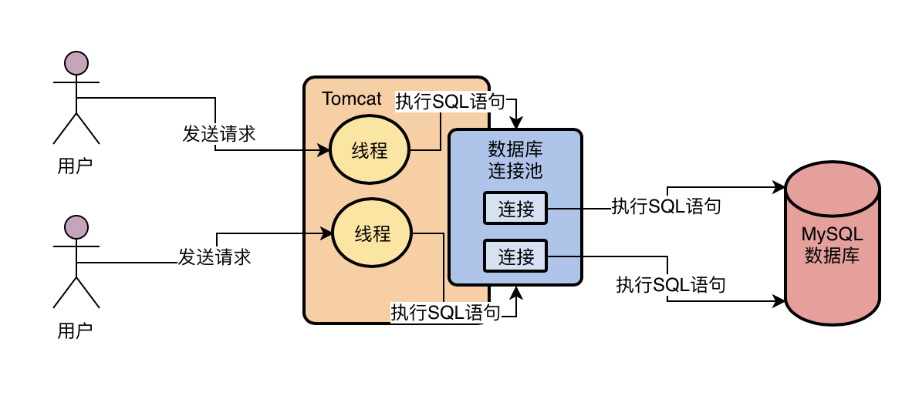

**常见的数据库连接池有DBCP，C3P0，Druid，等等，大家如果有兴趣的话，可以去搜索一下数据库连接池的使用例子和代码，甚至探索一下数据库连接池的底层原理，但这个不是我们专栏的重点，我们就不会拓展了。**

毕竟我们专栏主要还是会专注讲解MySQL数据库本身的内容，只不过在开头的时候，需要大家对Java系统与数据库的交互方式有一个了解。

其实不光是Java系统，如果你是一个Python、Ruby、.NET、PHP的程序员，这个系统与数据库的交互本质都是一样的，都是基于数据库连接池去与数据库进行交互。

**4、MySQL数据库的连接池是用来干什么的？**

现在我们已经知道，我们任何一个系统都会有一个数据库连接池去访问数据库，也就是说这个系统会有多个数据库连接，供多线程并发的使用。同时我们可能会有多个系统同时去访问一个数据库，这都是有可能的。

所以当我们把目光转移到MySQL的时候，我们要来思考一个问题，那就是肯定会有很多系统要与MySQL数据库建立很多个连接，那么MySQL也必然要维护与系统之间的多个连接，所以**MySQL架构体系中的第一个环节，就是连接池**。

我们看下面的图，实际上MySQL中的**连接池**就是维护了与系统之间的多个数据库连接。除此之外，你的系统每次跟MySQL建立连接的时候，还会根据你传递过来的账号和密码，进行账号密码的验证，库表权限的验证。

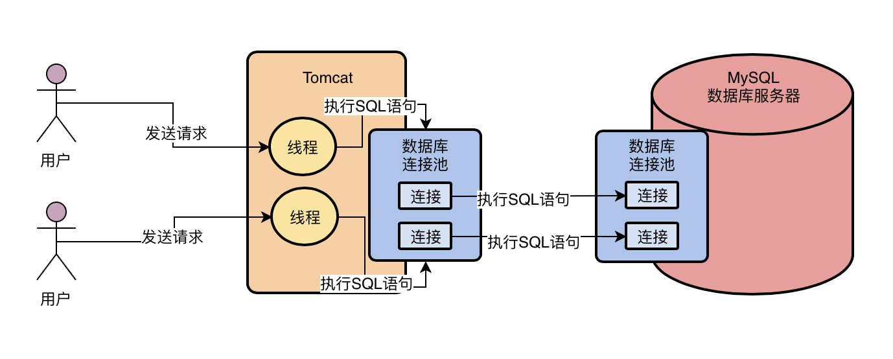

**5、小作业：自己试一试写代码建立MySQL连接**

当我们看完今天的内容后，大家可以用自己工作中经常使用的编程语言，来写一下跟MySQL建立连接的代码，想必写完之后，再对照今天的内容，感受会更深一些。

另外，大家可以基于数据库连接池框架，去写一下对应的代码例子，感受一下你建立多个数据库连接让多个线程并发访问数据库的效果。


## 02 为了执行SQL语句，你知道MySQL用了什么样的架构设计吗？

**1、把MySQL当个黑盒子一样执行SQL语句**

上一讲我们已经说到，我们的系统采用数据库连接池的方式去并发访问数据库，然后数据库自己其实也会维护一个连接池，其中管理了各种系统跟这台数据库服务器建立的所有连接

我们先看下图回顾一下

```

```

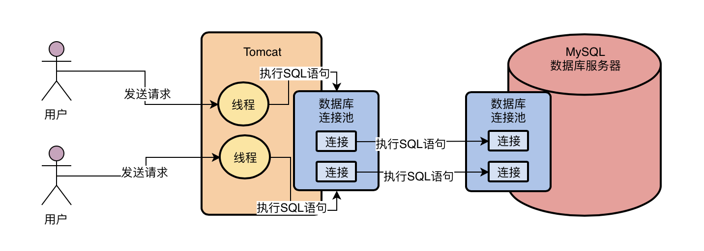

当我们的系统只要能从数据库连接池获取到一个数据库连接之后，我们就可以执行增删改查的SQL语句了

从上图其实我们就可以看到，我们可以通过数据库连接把要执行的SQL语句发送给MySQL数据库。

然后呢？大部分同学了解到这个程度就停下来了，然后大家觉得要关注的可能主要就是数据库里的表结构，建了哪些索引，然后就按照SQL语法去编写增删改查SQL语句，把MySQL当个黑盒子去执行SQL语句就可以了。

我们只知道执行了insert语句之后，在表里会多出来一条数据；执行了update语句之后，会对表里的数据进行更改；执行了delete语句之后，会把表里的一条数据删除掉；执行了select语句之后，会从表里查询一些数据出来。

如果语句性能有点差？没关系，在表里建几个索引就可以了！可能这就是目前行业内很多工程师对数据库的一个认知，完全当他是个黑盒子，来建表以及执行SQL语句。

但是大家既然跟着我开始学习了，从现在开始就要打破这种把数据库当黑盒子的认知程度，要<u>深入底层</u>，去探索**数据库的工作原理**以及**生产问题的优化手段**！

**2、一个不变的原则：网络连接必须让线程来处理**

现在假设我们的数据库服务器的连接池中的某个连接接收到了网络请求，假设就是一条SQL语句，那么大家先思考一个问题，谁负责从这个连接中去监听网络请求？谁负责从网络连接里把请求数据读取出来？

我想很多人恐怕都没思考过这个问题，但是如果大家对计算机基础知识有一个简单了解的话，应该或多或少知道一点，那就是网络连接必须得分配给一个线程去进行处理，由一个线程来监听请求以及读取请求数据，比如从网络连接中读取和解析出来一条我们的系统发送过去的SQL语句，如下图所示：

```

```

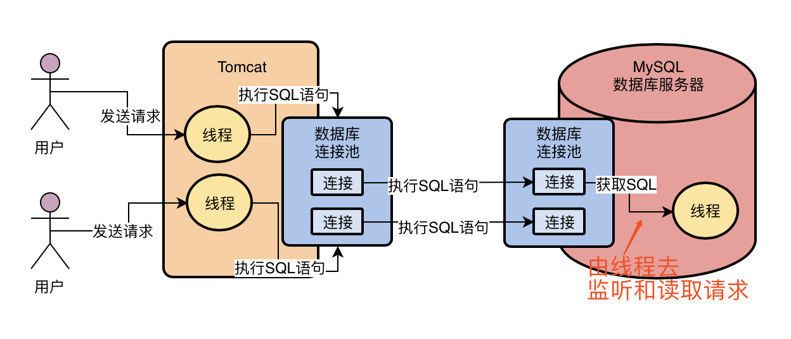

**Figure 16.3 MySQL Architecture with Pluggable Storage Engines**


Figure 8-1. Execution path of a query
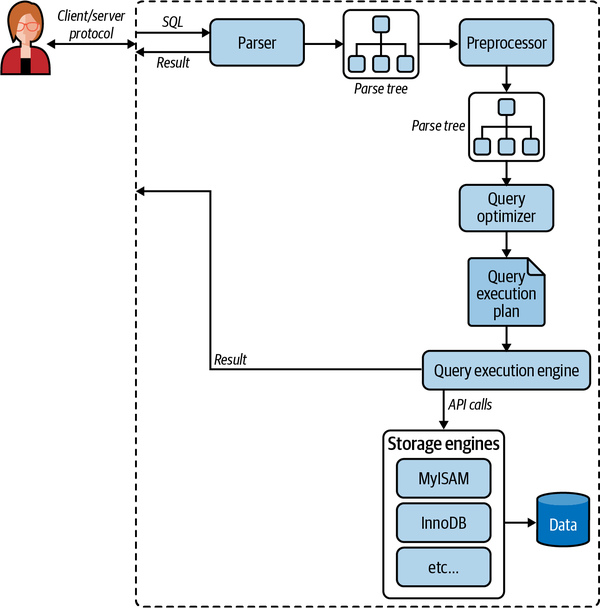


**3、SQL接口：负责处理接收到的SQL语句**

接着我们来思考一下，当MySQL内部的工作线程从一个网络连接中读取出来一个SQL语句之后，此时会如何来执行这个SQL语句呢？

其实SQL是一项伟大的发明，他发明了简单易用的数据读写的语法和模型，哪怕是个产品经理，或者是运营专员，甚至是销售专员，即使他不会技术，他也能轻松学会使用SQL语句。

但如果你要去执行这个SQL语句，去完成底层数据的增删改查，那这就是一项极度复杂的任务了！

所以MySQL内部首先提供了一个组件，就是**SQL接口（SQL Interface）**，他是一套执行SQL语句的接口，专门用于执行我们发送给MySQL的那些增删改查的SQL语句

因此MySQL的工作线程接收到SQL语句之后，就会转交给SQL接口去执行，如下图。

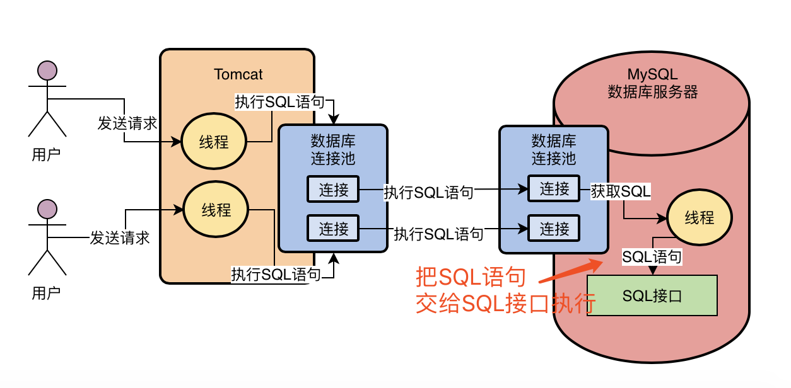

**4、查询解析器：让MySQL能看懂SQL语句**

接着下一个问题来了，SQL接口怎么执行SQL语句呢？你直接把SQL语句交给MySQL，他能看懂和理解这些SQL语句吗？

比如我们来举一个例子，现在我们有这么一个SQL语句：

select id,name,age from users where id=1

这个SQL语句，我们用人脑是直接就可以处理一下，只要懂SQL语法的人，立马大家就知道他是什么意思，但是MySQL自己本身也是一个系统，是一个数据库管理系统，他没法直接理解这些SQL语句！

所以此时有一个关键的组件要出场了，那就是**查询解析器**

这个**查询解析器（Parser）**就是负责对SQL语句进行解析的，比如对上面那个SQL语句进行一下拆解，拆解成以下几个部分：

1. 我们现在要从“users”表里查询数据
2. 查询“id”字段的值等于1的那行数据
3. 对查出来的那行数据要提取里面的“id,name,age”三个字段。

所谓的SQL解析，就是按照既定的SQL语法，对我们按照SQL语法规则编写的SQL语句进行解析，然后理解这个SQL语句要干什么事情，如下图所示：

```

```


**5、查询优化器：选择<u>最优的查询路径</u>**

当我们通过解析器理解了SQL语句要干什么之后，接着会找**查询优化器（Optimizer）**来选择一个<u>最优的查询路径</u>。

可能有同学这里就不太理解什么是<u>最优的查询路径</u>了，这个看起来确实很抽象，当然，这个查询优化器的工作原理，后续将会是我们分析的重点，大家现在不用去纠结他的原理。

但是我们可以用一个极为通俗简单的例子，让大家理解一下所谓的最优查询路径是什么。

就用我们刚才讲的那个例子好了，我们现在理解了一个SQL想要干这么一个事儿：我们现在要从“users”表里查询数据，查询“id”字段的值等于1的那行数据，对查出来的那行数据要提取里面的“id,name,age”三个字段。

事是明白了，但是到底应该怎么来实现呢？

你看，要完成这个事儿我们有以下几个查询路径（**纯属用于大家理解的例子，不代表真实的MySQL原理，但是通过这个例子，大家肯定能理解所谓最优查询路径的意思**）：

1. 直接定位到“users”表中的“id”字段等于1的一行数据，然后查出来那行数据的“id,name,age”三个字段的值就可以了
2. 先把“users”表中的每一行数据的“id,name,age”三个字段的值都查出来，然后从这批数据里过滤出来“id”字段等于1的那行数据的“id,name,age”三个字段

上面这就是一个最简单的SQL语句的两种实现路径，其实我们会发现，要完成这个SQL语句的目标，两个路径都可以做到，但是哪一种更好呢？显然感觉上是第一种查询路径更好一些。

所以查询优化器大概就是干这个的，他会针对你编写的几十行、几百行甚至上千行的复杂SQL语句生成查询路径树，然后从里面选择一条最优的查询路径出来。

相当于他会告诉你，你应该按照一个什么样的步骤和顺序，去执行哪些操作，然后一步一步的把SQL语句就给完成了。

我们来一起看看下面的图：      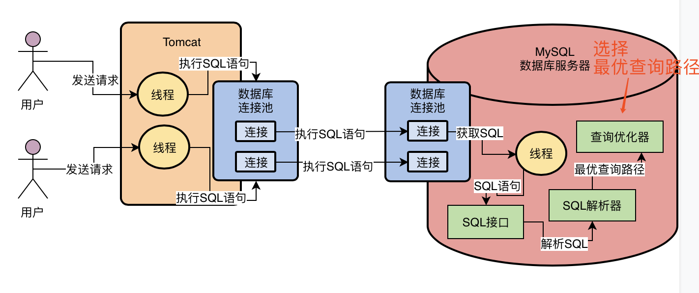

**6、调用存储引擎接口，真正执行SQL语句**

最后一步，就是把查询优化器选择的最优查询路径，也就是你到底应该按照一个什么样的顺序和步骤去执行这个SQL语句的计划，把这个计划交给底层的存储引擎去真正的执行。这个存储引擎是MySQL的架构设计中很有特色的一个环节。

不知道大家是否思考过，真正在执行SQL语句的时候，要不然是更新数据，要不然是查询数据，那么数据你觉得存放在哪里？

说白了，数据库也不是什么神秘莫测的东西，你可以把他理解为本身就是一个类似你平时写的图书馆管理系统、电信计费系统、电商订单系统之类的系统罢了。

数据库自己就是一个编程语言写出来的系统而已，然后启动之后也是一个进程，执行他里面的各种代码，也就是我们上面所说的那些东西。所以对数据库而言，我们的数据要不然是放在**内存**里，要不然是放在**磁盘文件**里，没什么特殊的地方！

所以我们来思考一下，假设我们的数据有的存放在**内存**里，有的存放在**磁盘文件**里，如下图所示。

```

```

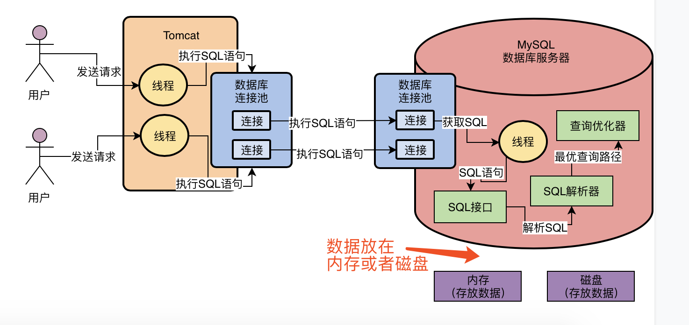

那么现在问题来了，我们已经知道一个SQL语句要如何执行了，但是我们现在怎么知道哪些数据在内存里？哪些数据在磁盘里？我们执行的时候是更新内存的数据？还是更新磁盘的数据？我们如果更新磁盘的数据，是先查询哪个磁盘文件，再更新哪个磁盘文件？

是不是感觉一头雾水

所以这个时候就需要**存储引擎**了，存储引擎其实就是执行SQL语句的，他会按照一定的步骤去查询内存缓存数据，更新磁盘数据，查询磁盘数据，等等，执行诸如此类的一系列的操作，如下图所示。

```

```

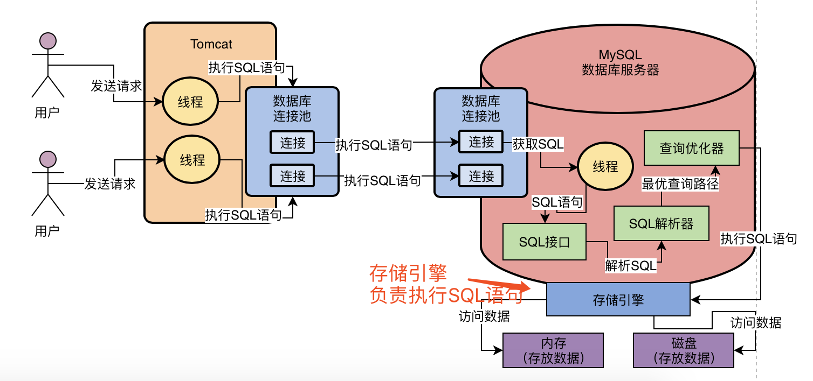

MySQL的架构设计中，SQL接口、SQL解析器、查询优化器其实都是通用的，他就是一套组件而已。

但是存储引擎的话，他是支持各种各样的存储引擎的，比如我们常见的InnoDB、MyISAM、Memory等等，我们是可以选择使用哪种存储引擎来负责具体的SQL语句执行的。

当然现在MySQL一般都是使用InnoDB存储引擎的，至于存储引擎的原理，后续我们也会深入一步一步分析，大家不必着急。

**7、执行器：根据执行计划调用存储引擎的接口**

那么看完存储引擎之后，我们回过头来思考一个问题，存储引擎可以帮助我们去访问内存以及磁盘上的数据，那么是谁来调用存储引擎的接口呢？

其实我们现在还漏了一个执行器的概念，这个执行器会根据优化器选择的执行方案，去调用存储引擎的接口按照一定的顺序和步骤，就把SQL语句的逻辑给执行了。

举个例子，比如执行器可能会先调用存储引擎的一个接口，去获取“users”表中的第一行数据，然后判断一下这个数据的“id”字段的值是否等于我们期望的一个值，如果不是的话，那就继续调用存储引擎的接口，去获取“users”表的下一行数据。

就是基于上述的思路，**<u>执行器</u>就会去根据我们的优化器生成的一套执行计划，然后不停的调用存储引擎的各种接口去完成SQL语句的执行计划**，大致就是不停的更新或者提取一些数据出来

我们看下图的示意

```

```


**8、小思考题：打开脑洞，你觉得不同的存储引擎是用来干什么的？**

今天给大家留一个小的思考题，就是你先别管MySQL有哪些存储引擎，你就从业务场景来出发考虑，有的场景可能是高并发的更新，有的场景可能是大规模数据查询，有的场景可能是允许丢失数据的

那么你觉得如果让你来设计存储引擎，你觉得应该有哪些存储引擎，分别适用于什么场景？


## 03 用一次数据更新流程，初步了解InnoDB存储引擎的架构设计

**1、更新语句在MySQL中是如何执行的？**

之前我们已经分析了MySQL架构上的整体设计原理，现在对一条SQL语句从我们的系统层面发送到MySQL中，然后一步一步执行这条SQL的流程，都有了一个整体的了解。

我们已经知道了，MySQL最常用的就是InnoDB存储引擎，那么我们今天借助一条更新语句的执行，来初步的了解一下InnoDB存储引擎的架构设计。

首先假设我们有一条SQL语句是这样的：

update users set name='xxx' where id=10

那么我们先想一下这条SQL语句是如何执行的？

首先肯定是我们的系统通过一个数据库连接发送到了MySQL上，然后肯定会经过SQL接口、解析器、优化器、执行器几个环节，解析SQL语句，生成执行计划，接着去由执行器负责这个计划的执行，调用InnoDB存储引擎的接口去执行。

所以先看下图，大致还是会走下图的这个流程

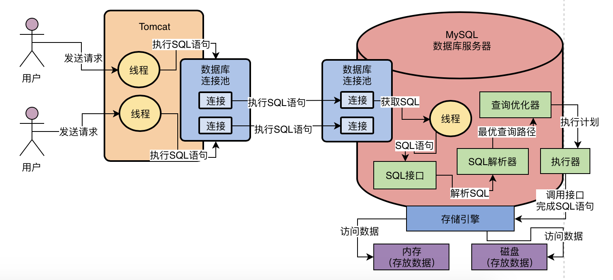

今天我们就来探索一下这个<u>**存储引擎**里的架构设计</u>，以及如何基于存储引擎完成一条更新语句的执行

**2、InnoDB的重要内存结构：缓冲池**

**Figure 15.1 InnoDB Architecture**


InnoDB存储引擎中有一个非常重要的放在内存里的组件，就是**缓冲池（Buffer Pool）**，这里面会缓存很多的数据，以便于以后在查询的时候，万一你要是内存缓冲池里有数据，就可以不用去查磁盘了，我们看下图。

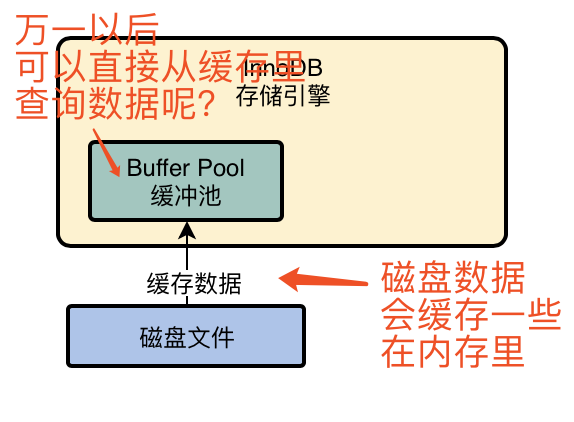   

所以当我们的InnoDB存储引擎要执行更新语句的时候 ，比如对“id=10”这一行数据，他其实会先将“id=10”这一行数据看看是否在缓冲池里，如果不在的话，那么会直接从磁盘里加载到缓冲池里来，而且接着还会对这行记录加独占锁。

因为我们想一下，在我们更新“id=10”这一行数据的时候，肯定是不允许别人同时更新的，所以必须要对这行记录加独占锁

至于锁的详细分析，我们后续也会有，大家不用着急，在这里先初步了解即可，我们看下面的图

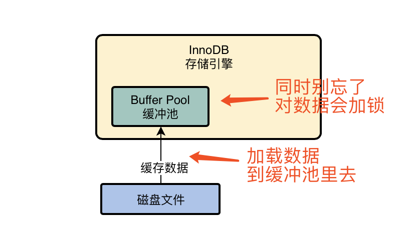

**3、undo日志文件：如何让你更新的数据可以回滚？**

接着下一步，假设“id=10”这行数据的name原来是“zhangsan”，现在我们要更新为“xxx”，那么此时我们得先把要更新的原来的值“zhangsan”和“id=10”这些信息，写入到undo日志文件中去。

其实稍微对数据库 有一点了解的同学都应该知道，如果我们执行一个更新语句，要是他是在一个事务里的话，那么事务提交之前我们都是可以对数据进行回滚的，也就是把你更新为“xxx”的值回滚到之前的“zhangsan”去。

所以为了考虑到未来可能要回滚数据的需要，这里会把你更新前的值写入undo日志文件，我们看下图。

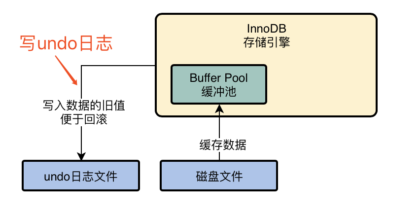

**4、更新buffer pool中的缓存数据**

当我们把要更新的那行记录从磁盘文件加载到缓冲池，同时对他加锁之后，而且还把更新前的旧值写入undo日志文件之后，我们就可以正式开始更新这行记录了，更新的时候，先是会**更新<u>缓冲池</u>中的记录**，此时这个数据就是脏数据了。

这里所谓的更新内存缓冲池里的数据，意思就是把**内存里的**“id=10”这行数据的name字段修改为“xxx”

那么为什么说此时这行数据就是脏数据了呢？

因为这个时候磁盘上“id=10”这行数据的name字段还是“zhangsan”，但是内存里这行数据已经被修改了，所以就会叫他是脏数据。

我们看下图，我同时把几个步骤的序号标记出来了。

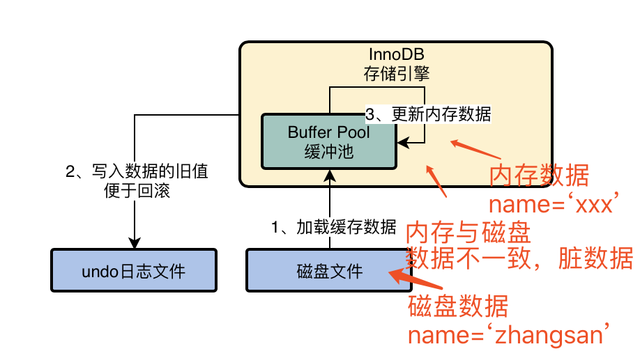

**5、Redo Log Buffer：万一系统宕机，如何避免数据丢失？**

接着我们来思考一个问题，按照上图的说明，现在已经把内存里的数据进行了修改，但是磁盘上的数据还没修改。

那么此时万一MySQL所在的机器宕机了，必然会导致内存里修改过的数据丢失，这可怎么办呢？

这个时候，就必须要把对内存所做的修改写入到一个**Redo Log Buffer**里去，这也是内存里的一个缓冲区，是用来存放redo日志的。

所谓的redo日志，就是记录下来你对数据做了什么修改，比如对“id=10这行记录修改了name字段的值为xxx”，这就是一个日志。

我们先看下图的示意

```

```

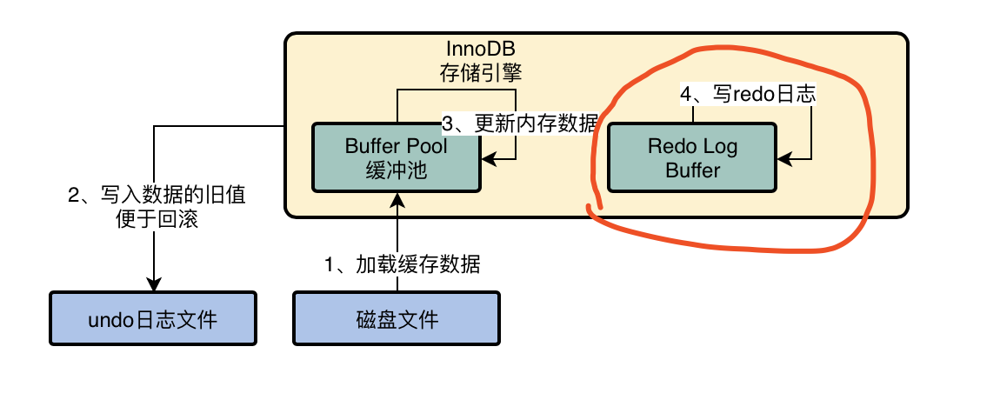

这个redo日志其实是用来在MySQL突然宕机的时候，用来恢复你更新过的数据的，但是我们现在还没法直接讲解redo是如何使用的，毕竟现在redo日志还仅仅停留在内存缓冲里。

大家稍安勿躁，继续往下看

**6、如果还没提交事务，MySQL宕机了怎么办？**

这里我们假设每个人看专栏的人，都对MySQL的基本SQL语法、事务的基本概念以及索引的基本概念有一个基础的了解，因为但凡一个后端工程师，要跟数据库打交道，必然会跟这些概念有一定的了解。

所以我们都知道，其实在数据库中，哪怕执行一条SQL语句，其实也可以是一个独立的事务，只有当你提交事务之后，SQL语句才算执行结束。

所以这里我们都知道，到目前为止，其实还没有提交事务，那么此时如果MySQL崩溃，必然导致内存里Buffer Pool中的修改过的数据都丢失，同时你写入Redo Log Buffer中的redo日志也会丢失。

我们看下图

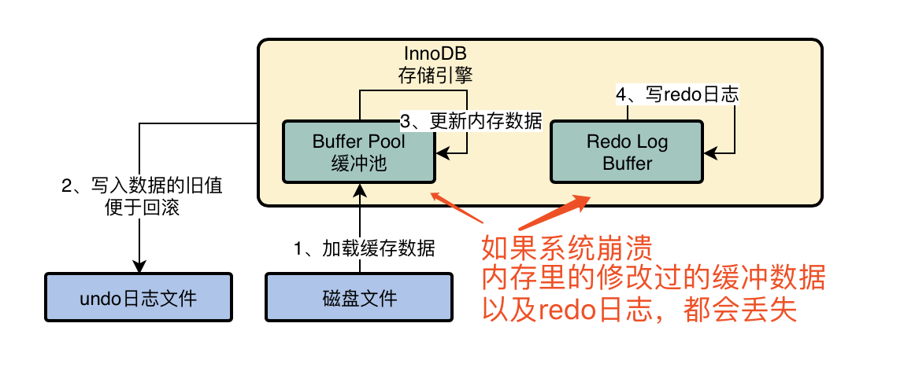

那么此时数据丢失要紧吗？

其实是不要紧的，因为你一条更新语句，没提交事务，就代表他没执行成功，此时MySQL宕机虽然导致内存里的数据都丢失了，但是你会发现，磁盘上的数据依然还停留在原样子。

也就是说，“id=1”的那行数据的name字段的值还是老的值，“zhangsan”，所以此时你的这个事务就是执行失败了，没能成功完成更新，你会收到一个数据库的异常。然后当mysql重启之后，你会发现你的数据并没有任何变化。

所以此时如果mysql宕机，不会有任何的问题。

**7、<u>提交事务的时候</u>将redo日志写入磁盘中**

接着我们想要提交一个事务了，此时就会根据一定的策略把redo日志从redo log buffer里刷入到磁盘文件里去。

此时这个策略是通过innodb_flush_log_at_trx_commit来配置的，他有几个选项。

当这个参数的值为0的时候，那么你提<u>交事务的时候</u>，不会把redo log buffer里的数据刷入磁盘文件的，此时可能你都提交事务了，结果mysql宕机了，然后此时内存里的数据全部丢失。

相当于你提交事务成功了，但是由于MySQL突然宕机，导致内存中的数据和redo日志都丢失了，我们看下图：

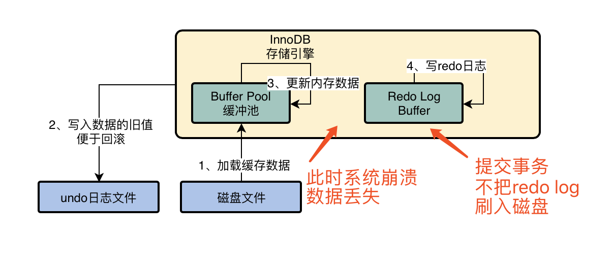当这个参数的值为1的时候，你<u>提交事务的时候</u>，就必须把redo log从内存刷入到磁盘文件里去，只要事务提交成功，那么redo log就必然在磁盘里了，我们看下图：

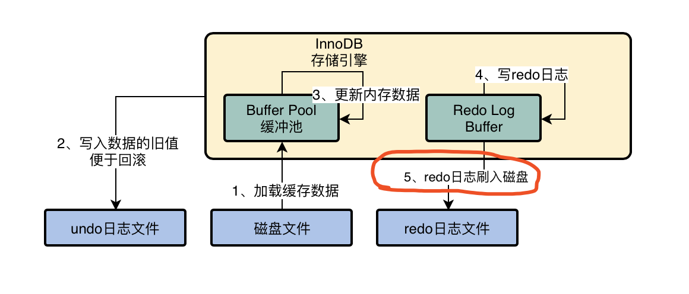那么只要提交事务成功之后，redo日志一定在磁盘文件里，此时你肯定会有一条redo日志说了，“我此时对哪个数据做了一个什么修改，比如name字段修改为xxx了”。

然后哪怕此时buffer pool中更新过的数据还没刷新到磁盘里去，此时内存里的数据是已经更新过的“name=xxx”，然后磁盘上的数据还是没更新过的“name=zhangsan”。

我们看下图，提交事务之后，可能处于的一个状态。

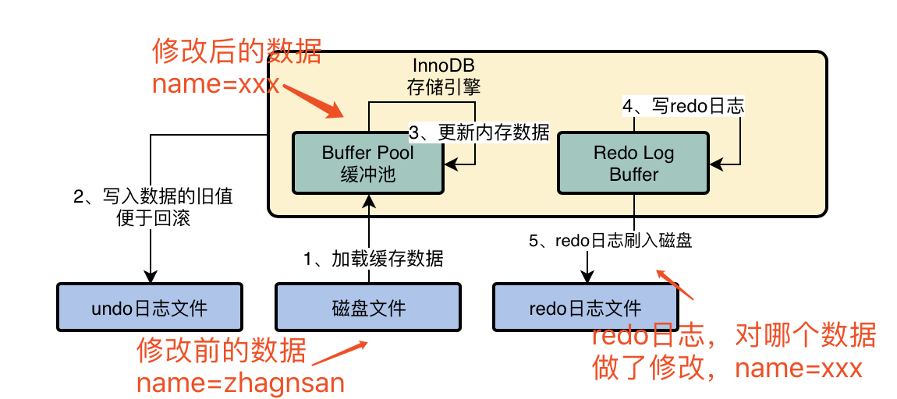

此时如果说提交事务后处于上图的状态，然后mysql系统突然崩溃了，此时会如何？会丢失数据吗？

肯定不会啊，因为虽然内存里的修改成name=xxx的数据会丢失，但是**<u>redo日志</u>**里**已经**说了，对某某数据做了修改name=xxx。

所以此时<u>mysql</u>重启之后，他可以<u>根据**redo日志**去恢复之前做过的修改</u>，我们看下图。


最后来看看，如果innodb_flush_log_at_trx_commit参数的值是2呢？

他的意思就是，<u>提交事务的时候</u>，把<u>redo日志</u>写入磁盘文件对应的<u>os cache缓存</u>里去，而不是直接进入磁盘文件，可能1秒后才会把<u>os cache</u>里的数据写入到磁盘文件里去。

这种模式下，你提交事务之后，redo log可能仅仅停留在os cache内存缓存里，没实际进入磁盘文件，万一此时你要是机器宕机了，那么os cache里的redo log就会丢失，同样会让你感觉提交事务了，结果数据丢了，看下图。


**// 《MySQL Administrator's Bible    2009》**

### Recovering MySQL Transactions

To be ACID-compliant, 
a database system must resolve situations where a transaction is interrupted and where data from a completed transaction has not been written to disk. Perhaps the power goes out, the hard drive crashes, or the database tries to use too much memory and crashes.

If such an interruption occurs, when <code>mysqld</code> starts again there is potentially inconsistent data.
Inconsistent data is resolved through a recovery process involving log files that are called <u>transactional log</u>s. 
There are two types of <u>transactional log</u>s — the ***redo log***s and ***undo log***s.

**Redo log**s are used to apply changes that were made in memory but not flushed to the permanent table records. 
Before a `COMMIT` statement is successful, the **redo log** is written to. 
Logging is done in this manner because it provides for faster database operation. 
This might be seen as counter-intuitive at first look. 
Instead of writing to only the data file(s), `mysqld` additionally writes the **redo log**. 
Writes to the **redo log**s are always sequential, whereas often data files are not written to sequentially. 
Sequential writes are faster than non-sequential writes. 
Therefore, 
the much faster <u>**redo log** write</u>s occur when a statement is committed, and 
the slower writes to the data files can be batched periodically. 
Thus, the database actually operates faster writing to both files rather than just one file.

The **redo log**s are stored in different places for different transactional storage engines — the storage engine defines the exact **redo log** implementation. 
When `mysql`d starts up after a crash, it checks and applies all **redo log**s. 
This <u>application</u> of the **redo log**s provides the durability part of ACID compliance in transactional storage engines within MySQL.  

**Undo log**s are used to roll back uncommitted transactions. 
When a transaction is started and commands are executed, 
the storage engine does not know if the transaction will end with a `COMMIT`, `ROLLBACK`, or with an interruption from a crash. 
Ending with a `COMMIT` means all the changes made in the course of the transaction will be preserved 
(fulfilling the consistency requirement of ACID compliance). 
This is true whether the `COMMIT` was explicitly issued to end the transaction, or an implicit `COMMIT` occurred
 — see the section ‘‘Using Transactional Statements’’ earlier in this chapter for more information on statements that perform an implicit COMMIT.

If the transaction ends with a `ROLLBACK` command, all changes made by the transaction need to be undone. 
Changes also need to be undone if the transaction gets interrupted for some reason, 
such as mysqld crashing or the client disconnecting before ending the transaction. 
The **undo log**s store the changes that need to be done. 
The **undo log**s also store the savepoints, and are used when a `ROLLBACK TO SAVEPOINT` statement is issued.

In the crash recovery process, 
after the <u>**redo log** file</u>s are applied 
`mysqld` will need to roll back the transactions that were not committed but had already made changes to the database. 
**Undo log**s are used to roll back these transactional changes.

As an example, imagine running a transaction adding 1,000,000 rows, and the operating system crashes after 800,000 inserts are performed. 
When `mysqld` restarts after the operating system is back up, 
first the **redo log**s are applied to get the database server into a consistent state — with the 800,000 inserts done. 
Then `mysqld` will perform a rollback of the 800,000 inserts using the **undo log**s.

In InnoDB, **undo log**s are stored in the data files, and **redo log**s are stored in the innodb log files. 
For Falcon the **undo** and **redo log**s are stored in the serial log file. 
The binary logs (`bin-log`) are not used in crash recovery and do not contain undo or redo information.  


**8、小思考题：三种redo日志刷盘策略到底选择哪一种？**

今天给大家留一个小的思考题，大家觉得在提交事务的时候，我们对redo日志的刷盘策略应该选择哪一种？每一种刷盘策略的优缺点分别是什么？为什么？


## 04 借着更新语句在InnoDB存储引擎中的执行流程，聊聊binlog是什么？

**1、上一讲思考题解答：redo日志刷盘策略的选择建议**

先给大家解释一下上一讲的思考题，我给大家的一个建议，其实对于redo日志的三种刷盘策略，我们通常建议是设置为1

也就是说，提交事务的时候，redo日志必须是刷入磁盘文件里的。

这样可以严格的保证提交事务之后，数据是绝对不会丢失的，因为有redo日志在磁盘文件里可以恢复你做的所有修改。

如果要是选择0的话，可能你提交事务之后，mysql宕机，那么此时redo日志没有刷盘，导致内存里的redo日志丢失，你提交的事务更新的数据就丢失了；

如果要是选择2的话，如果机器宕机，虽然之前提交事务的时候，redo日志进入os cache了，但是还没进入磁盘文件，此时机器宕机还是会导致os cache里的redo日志丢失。

所以对于数据库这样严格的系统而言，一般建议redo日志刷盘策略设置为1，保证事务提交之后，数据绝对不能丢失。

**2、MySQL binlog到底是什么东西？**

接着我们来看看MySQL binlog到底是个什么东西？

实际上我们之前说的redo log，他是一种**偏向<u>物理</u>性质的**重做日志，因为他里面记录的是类似这样的东西，“对哪个数据页中的什么记录，做了个什么修改”。

而且**redo log本身是属于InnoDB存储引擎特有的一个东西**。

而<u>binlog</u>叫做<u>归档日志</u>，他里面记录的是**偏向于<u>逻辑</u>性的**日志，类似于“对users表中的id=10的一行数据做了更新操作，更新以后的值是什么”。

**binlog**不是InnoDB存储引擎特有的日志文件，**是属于mysql server自己的日志文件**。

**3、提交事务的时候，同时会写入binlog**

所以其实我们上一讲讲到，在我们提交事务的时候，会把redo log日志写入磁盘文件中去。然后其实在<u>提交事务的时候</u>，我们同时还会把这次更新对应的binlog日志写入到磁盘文件中去，如下图所示。

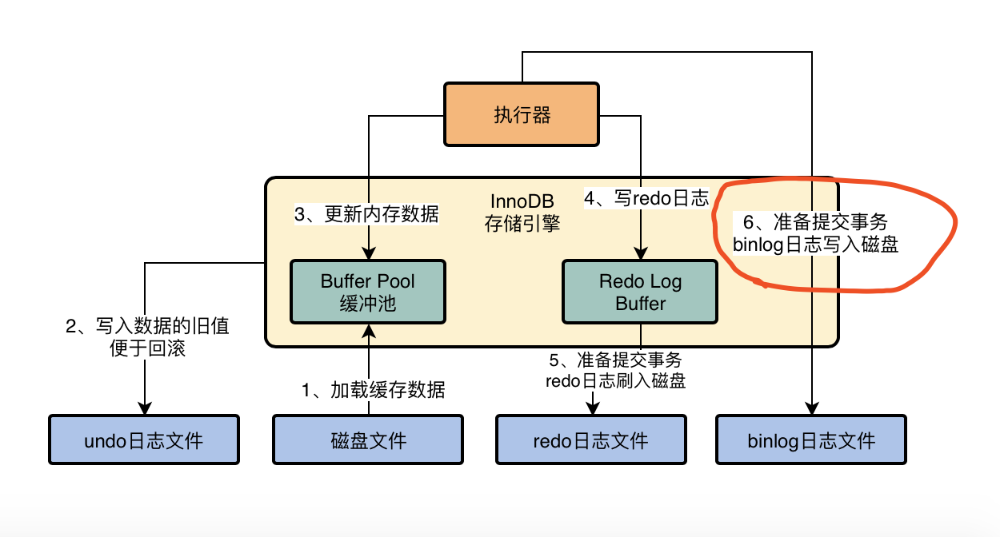

大家可以在这个图里看到一些变动，
就是我把跟InnoDB存储引擎进行交互的组件加入了之前提过的**执行器**这个组件，他会负责跟InnoDB进行交互，包括从磁盘里加载数据到Buffer Pool中进行缓存，包括写入undo日志，包括更新Buffer Pool里的数据，以及写入redo log buffer，redo log刷入磁盘，写binlog，等等。

实际上，**执行器**是非常核心的一个组件，负责跟存储引擎配合完成一个SQL语句在磁盘与内存层面的全部数据更新操作。

而且我们在上图可以看到，我把一次更新语句的执行，拆分为了两个阶段，上图中的1、2、3、4几个步骤，其实本质是你执行这个更新语句的时候干的事。

然后上图中的5和6两个步骤，是从你提交事务开始的，属于提交事务的阶段了。

**4、binlog日志的刷盘策略分析**

对于binlog日志，其实也有不同的刷盘策略，有一个<u>**sync_binlog**参数</u>可以控制binlog的刷盘策略，他的默认值是0，此时你把binlog写入磁盘的时候，其实不是直接进入磁盘文件，而是进入os cache内存缓存。

所以跟之前分析的一样，如果此时机器宕机，那么你在os cache里的binlog日志是会丢失的，我们看下图的示意

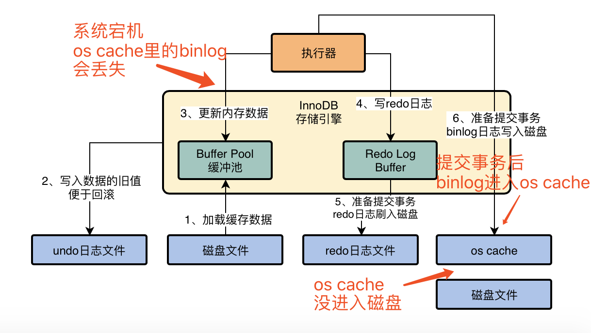

如果要是把**sync_binlog**参数设置为1的话，那么此时会强制在提交事务的时候，把binlog直接写入到磁盘文件里去，那么这样提交事务之后，哪怕机器宕机，磁盘上的binlog是不会丢失的，如下图所示

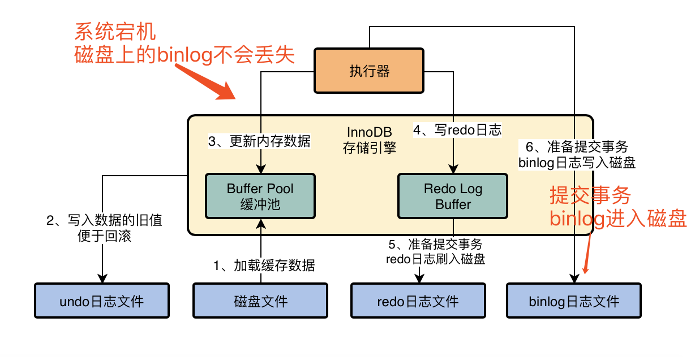

**5、基于binlog和redo log完成事务的提交**

当我们把binlog写入磁盘文件之后，接着就会完成<u>最终的事务提交</u>，此时会**把本次更新对应的binlog文件名称和这次更新的binlog日志在文件里的位置，都写入到redo log日志文件里去，同时在redo log日志文件里写入一个commit标记**。

在完成这个事情之后，才算最终完成了事务的提交，我们看下图的示意。

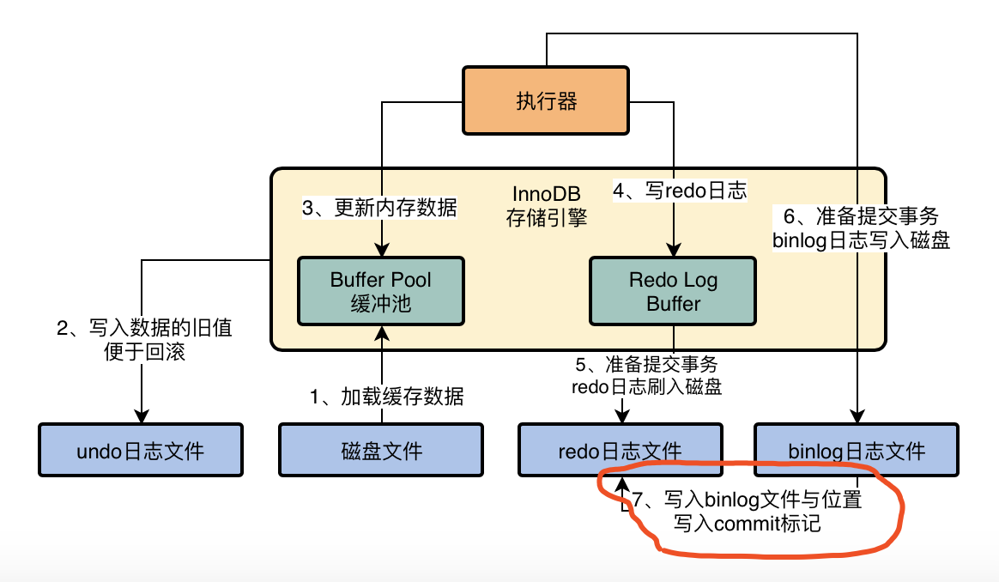

**6、最后一步在redo日志中写入commit标记的意义是什么？**

这时候肯定有同学会问了，**最后在redo日志中写入commit标记**有什么**意义**呢？

说白了，他其实是**用来保持redo log日志与binlog日志一致**的。

我们来举个例子，假设我们在提交事务的时候，一共有上图中的5、6、7三个步骤，必须是三个步骤都执行完毕，才算是提交了事务。那么在我们刚完成步骤5的时候，也就是redo log刚刷入磁盘文件的时候，mysql宕机了，此时怎么办？

这个时候因为没有最终的事务commit标记在redo日志里，所以此次事务可以判定为不成功。不会说redo日志文件里有这次更新的日志，但是binlog日志文件里没有这次更新的日志，不会出现数据不一致的问题。

如果要是完成步骤6的时候，也就是binlog写入磁盘了，此时mysql宕机了，怎么办？

同理，因为没有redo log中的最终commit标记，因此此时事务提交也是失败的。

**必须是在redo log中写入最终的<u>事务commit标记</u>了，然后此时事务提交成功，**
而且redo log里有本次更新对应的日志，binlog里也有本次更新对应的日志 ，redo log和binlog完全是一致的。

**7、<u>后台IO线程</u>随机将内存更新后的脏数据刷回磁盘**

现在我们假设已经提交事务了，此时一次更新“update users set name='xxx' where id=10”，他已经把内存里的buffer pool中的缓存数据更新了，同时磁盘里有redo日志和binlog日志，都记录了把我们指定的“id=10”这行数据修改了“name='xxx'”。

此时我们会思考一个问题了，但是这个时候磁盘上的数据文件里的“id=10”这行数据的name字段还是等于zhangsan这个旧的值啊！

所以MySQL有一个<u>后台的IO线程</u>，会在之后某个时间里，随机的把内存buffer pool中的修改后的脏数据给刷回到磁盘上的数据文件里去，我们看下图：


当上图中的<u>IO线程</u>把buffer pool里的修改后的脏数据刷回磁盘的之后，磁盘上的数据才会跟内存里一样，都是name=xxx这个修改以后的值了！

在你IO线程把脏数据刷回磁盘之前，哪怕mysql宕机崩溃也没关系，因为重启之后，会根据<u>redo日志</u>恢复之前提交事务做过的修改到内存里去，就是id=10的数据的name修改为了xxx，然后等适当时机，IO线程自然还是会把这个修改后的数据刷到磁盘上的数据文件里去的

**8、基于更新数据的流程，总结一下InnoDB存储引擎的架构原理**

大家通过一次更新数据的流程，就可以清晰地看到，
InnoDB存储引擎主要就是包含了一些buffer pool、redo log buffer等内存里的缓存数据，同时还包含了一些undo日志文件，redo日志文件等东西，
同时mysql server自己还有binlog日志文件。

在你执行更新的时候，每条SQL语句，都会对应修改buffer pool里的缓存数据、写undo日志、写redo log buffer几个步骤；

但是当你提交事务的时候，一定会把redo log刷入磁盘，binlog刷入磁盘，完成redo log中的事务commit标记；
最后后台的IO线程会随机的把buffer pool里的脏数据刷入磁盘里去。

**9、思考题：执行更新操作的时候，为什么不能执行修改磁盘上的数据？**

好了，今天的文章接近尾声，咱们再来思考一个问题：

- 为什么MySQL在更新数据的时候，要大费周章的搞这么多事情，包括buffer pool、redo log、undo log、binlog、事务提交、脏数据。引入了一大堆的概念，有复杂的流程和步骤。
- 为什么他反而最关键的修改磁盘里的数据，要通过IO线程不定时的去执行？
- 为什么他不干脆直接就每次执行SQL语句，直接就更新磁盘里的数据得了？


## 05 生产经验：真实生产环境下的数据库机器配置如何规划？

**1、当你了解数据库的架构原理之后，就该了解一下自己数据库的规划**


之前我们用了4篇文章给大家整体分析了一下MySQL数据库的工作原理，相信很多朋友都已经对数据库的整体架构原理有了一定的了解，毕竟在这之前，可能大部分人对MySQL数据库的了解还停留在执行SQL语句的程度。


当我们初步了解了数据库的架构设计原理后，接着其实应该了解的第一件事，就是我们平时在工作中，如何规划生产环境下的数据库。因为我想很多人如果平时主要是负责一些没什么并发量，用户量也就几十个或者几百个人的系统，那么根本就不会去关注数据库的规划这件事情。


对很多Java工程师而言，要不然是自己找一台linux机器装一个MySQL，然后就让自己的系统连接上去直接就开始使用了，要不然就是让DBA或者运维工程师帮自己去找一台机器装一个MySQL或者Oracle，然后自己就可以直接使用了。


但是在我们的专栏中，我们希望能够教会大家较为专业化的数据库使用经验，包括数据库的整体架构原理，还有就是如何规划生产环境下的数据库，包括当你有一个生产库之后，要做的事情就是设计压测方案，包括对你的数据库进行压测，包括对你的数据库部署可视化监控系统，等等。


当你做好这一系列的事情之后，接着才应该是开发你的Java系统，去操作你的数据库，实现各种各样的业务功能和逻辑。


**2、生产数据库一般用什么配置的机器？**


现在我们来看第一个问题，假设你在生产环境中需要部署一个数据库，此时首先你就需要一个机器来部署这个数据库。那么我们要考虑的事情就是，部署一个生产环境的数据库，一般需要什么样配置的机器呢？


接下来我们将会给大家说一些我们的经验值，直接告诉大家什么样配置的机器部署的MySQL数据库，大致适合多高的并发访问量


当你了解这个经验值之后，未来当你在负责系统的开发，申请数据库的时候，你就知道生产环境下的数据库大致需要什么样的机器配置了，大致可以抗下多少并发访问了。


首先我们先明确一点，如果你负责的系统就是一个没什么并发访问量，用户就几十个人或者几百个人的系统，那么其实你选择什么样的机器去部署数据库，影响都不是很大，哪怕是你用我们自己平时用的个人笔记本电脑去部署一个MySQL数据库，其实也能支撑那种低并发系统的运行。


因为那种系统可能每隔几分钟才会有一波请求发到数据库上去，而且数据库里一张表也许就几百条、几千条或者几万条数据，数据量很小，并发量很小，操作频率很低，用户量很小，并发量很小，只不过可能系统的业务逻辑很复杂而已。对于这类系统的数据库机器选型，就不在我们的考虑范围之内了。


我们主要关注的是有一定并发量的互联网类的系统，对数据库可能会产生每秒几百，每秒几千，甚至每秒上万的并发请求量，对于这类场景下，我们应该选择什么样的机器去部署数据库，才能比较好的抗下我们的系统压力。


**3、普通的Java应用系统部署在机器上能抗多少并发？**


通常来说，根据我们的经验值而言，Java应用系统部署的时候常选用的机器配置大致是2核4G和4核8G的较多一些，数据库部署的时候常选用的机器配置最低在8核16G以上，正常在16核32G


那么以我们大量的高并发线上系统的生产经验观察下来而言，一般Java应用系统部署在4核8G的机器上，每秒钟抗下500左右的并发访问量，差不多是比较合适的，当然这个也不一定。因为你得考虑一下，假设你每个请求花费1s可以处理完，那么你一台机器每秒也许只可以处理100个请求，但是如果你每个请求只要花费100ms就可以处理完，那么你一台机器每秒也许就可以处理几百个请求。


所以一台机器能抗下每秒多少请求，往往是跟你每个请求处理耗费多长时间是关联的，但是大体上来说，根据我们大量的经验观察而言，4核8G的机器部署普通的Java应用系统，每秒大致就是抗下几百的并发访问，从每秒一两百请求到每秒七八百请求，都是有可能的，关键是看你每个请求处理需要耗费多长时间。


**4、高并发场景下，数据库应该用什么样的机器？**


对于数据库而言，我们刚才也说过了，通常推荐的数据库至少是选用8核16G以的机器，甚至是16核32G的机器更加合适一些。


因为大家要考虑一个问题，对于我们的Java应用系统，主要耗费时间的是Java系统和数据库之间的网络通信。对Java系统自己而言，如果你仅仅只是系统内部运行一些普通的业务逻辑，纯粹在自己内存中完成一些业务逻辑，这个性能是极高极高的。


对于你Java系统接收到的每个请求，耗时最多的还是发送网络请求到数据库上去，等待数据库执行一些SQL语句，返回结果给你。


所以其实我们常说你有一个Java系统压力很大，负载很高，但是其实你要明白一点，你这个Java系统其实主要的压力和复杂都是集中在你依赖的那个MySQL数据库上的！


因为你执行大量的增删改查的SQL语句的时候，MySQL数据库需要对内存和磁盘文件进行大量的IO操作，所以数据库往往是负载最高的！这个问题我们在之前4篇文章里，通过MySQL数据库架构原理的分析，都已经讲解过了。


而你的Java系统一般并不需要你去直接大量的读写本地文件进行耗时的IO操作吧？是不是，想必做过Java开发的朋友一下子就会想明白这个道理。


所以往往对一个数据库而言，都是选用8核16G的机器作为起步，最好是选用16核32G的机器更加合适一些，因为数据库需要执行大量的磁盘IO操作，他的每个请求都比较耗时一些，所以机器的配置自然需要高一些了。


然后通过我们之前的经验而言，一般8核16G的机器部署的MySQL数据库，每秒抗个一两千并发请求是没问题的，但是如果你的并发量再高一些，假设每秒有几千并发请求，那么可能数据库就会有点危险了，因为数据库的CPU、磁盘、IO、内存的负载都会很高，弄不数据库压力过大就会宕机。


对于16核32G的机器部署的MySQL数据库而言，每秒抗个两三千，甚至三四千的并发请求也都是可以的，但是如果你达到每秒上万请求，那么数据库的CPU、磁盘、IO、内存的负载瞬间都会飙升到很高，数据库也是可能会扛不住宕机的。


所以这就是对于数据库，我们一般推荐选用的机器的配置，以及他大致可以抗下多高的并发请求量的经验分享。


另外对于数据库而言，如果可以的话，最好是采用SSD固态硬盘而不是普通的机械硬盘，因为数据库最大的复杂就在于大量的磁盘IO，他需要大量的读写磁盘文件，所以如果能使用SSD固态硬盘，那么你的数据库每秒能抗的并发请求量就会更高一些。


**5、今日思考题**

今天想留给大家一个小的思考题：假设你开发的Java系统部署在一台4核8G的机器上，那么我们假设这个Java系统处理一个请求非常非常快，每个请求只需要0.01ms就可以处理完了，那你觉得这一台机器部署的Java系统，可以实现每秒抗下几千并发请求吗？可以实现每秒抗下几万并发请求吗？


## 06 生产经验：互联网公司的生产环境数据库是如何进行性能测试的？

## 07 生产经验：如何对生产环境中的数据库进行360度无死角压测？

## 08 生产经验：在数据库的压测过程中，如何360度无死角观察机器性能？

## 09 生产经验：如何为生产环境中的数据库部署监控系统？

## 10 生产经验：如何为数据库的监控系统部署可视化报表系统？

## 11 从数据的增删改开始讲起，回顾一下Buffer Pool在数据库里的地位

## 12 Buffer Pool这个内存数据结构到底长个什么样子？

## 13 从磁盘读取数据页到Buffer Pool的时候，free链表有什么用？

## 14 当我们更新Buffer Pool中的数据时，flush链表有什么用？

## 15 当Buffer Pool中的缓存页不够的时候，如何基于LRU算法淘汰部分缓存？

## 16 简单的LRU链表在Buffer Pool实际运行中，可能导致哪些问题？

## 17 MySQL是如何基于冷热数据分离的方案，来优化LRU算法的？

## 18 基于冷热数据分离方案优化后的LRU链表，是如何解决之前的问题的？

## 19 MySQL是如何将LRU链表的使用性能优化到极致的？

## 20 对于LRU链表中尾部的缓存页，是如何淘汰他们刷入磁盘的？

## 21 生产经验：如何通过多个Buffer Pool来优化数据库的并发性能？

## 22 生产经验：如何通过chunk来支持数据库运行期间的Buffer Pool动态调整？

## 23 生产经验：在生产环境中，如何基于机器配置来合理设置Buffer Pool？

## 24 我们写入数据库的一行数据，在磁盘上是怎么存储的？

## 25 对于VARCHAR这种变长字段，在磁盘上到底是如何存储的？

## 26 一行数据中的多个NULL字段值在磁盘上怎么存储？

## 27 磁盘文件中， 40个bit位的数据头以及真实数据是如何存储的？

## 28 我们每一行的实际数据在磁盘上是如何存储的？

## 29 理解数据在磁盘上的物理存储之后，聊聊行溢出是什么东西？

## 30 用于存放磁盘上的多行数据的数据页到底长个什么样子？

## 31 表空间以及划分多个数据页的数据区，又是什么概念？

## 32 一文总结初步了解到的MySQL存储模型以及数据读写机制

## 33 MySQL数据库的日志顺序读写以及数据文件随机读写的原理

## 34 生产经验：Linux操作系统的存储系统软件层原理剖析以及IO调度优化原理

## 35 生产经验：数据库服务器使用的RAID存储架构初步介绍

## 36 生产经验：数据库服务器上的RAID存储架构的电池充放电原理

## 37 案例实战：RAID锂电池充放电导致的MySQL数据库性能抖动的优化

## 38 案例实战：数据库无法连接故障的定位，Too many connections

## 39 案例实战：如何解决经典的Too many connections故障？背后原理是什么

## 40 重新回顾redo日志对于事务提交后，数据绝对不会丢失的意义

## 41 在Buffer Pool执行完增删改之后，写入日志文件的redo log长什么样？

## 42 redo log是直接一条一条写入文件的吗？非也，揭秘redo log block！

## 43 直接强行把redo log写入磁盘？非也，揭秘redo log buffer！

## 44 redo log buffer中的缓冲日志，到底什么时候可以写入磁盘？

## 45 如果事务执行到一半要回滚怎么办？再探undo log回滚日志原理！

## 46 一起来看看INSRET语句的undo log回滚日志长什么样？

## 47 简单回顾一下， MySQL运行时多个事务同时执行是什么场景？

## 48 多个事务并发更新以及查询数据，为什么会有脏写和脏读的问题？

## 49 一个事务多次查询一条数据读到的都是不同的值，这就是不可重复读？

## 50 听起来很恐怖的数据库幻读，到底是个什么奇葩问题？

## 51 SQL标准中对事务的4个隔离级别，都是如何规定的呢？

## 52 MySQL是如何支持4种事务隔离级别的？Spring事务注解是如何设置的？

## 53 理解MVCC机制的前奏：undo log版本链是个什么东西？

## 54 基于undo log多版本链条实现的ReadView机制，到底是什么？

## 55 Read Committed隔离级别是如何基于ReadView机制实现的？

## 56 MySQL最牛的RR隔离级别，是如何基于ReadView机制实现的？

## 57 停一停脚步：梳理一下数据库的多事务并发运行的隔离机制

## 58 多个事务更新同一行数据时，是如何加锁避免脏写的？

## 59 对MySQL锁机制再深入一步，共享锁和独占锁到底是什么？

## 60 在数据库里，哪些操作会导致在表级别加锁呢？

## 61 表锁和行锁互相之间的关系以及互斥规则是什么呢？

## 62 案例实战：线上数据库不确定性的性能抖动优化实践（上）

## 63 案例实战：线上数据库莫名其妙的随机性能抖动优化（下）

## 64 深入研究索引之前，先来看看磁盘数据页的存储结构

## 65 假设没有任何索引，数据库是如何根据查询语句搜索数据的？

## 66 不断在表中插入数据时，物理存储是如何进行页分裂的？

## 67 基于主键的索引是如何设计的，以及如何根据主键索引查询？

## 68 索引的页存储物理结构，是如何用B+树来实现的？

## 69 更新数据的时候，自动维护的聚簇索引到底是什么？

## 70 针对主键之外的字段建立的二级索引，又是如何运作的？

## 71 插入数据时到底是如何维护好不同索引的B+树的？

## 72 一个表里是不是索引搞的越多越好？那你就大错特错了！

## 73 通过一步一图来深入理解联合索引查询原理以及全值匹配规则

## 74 再来看看几个最常见和最基本的索引使用规则

## 75 当我们在SQL里进行排序的时候，如何才能使用索引？

## 76 当我们在SQL里进行分组的时候，如何才能使用索引？

## 77 回表查询对性能的损害以及覆盖索引是什么？

## 78 设计索引的时候，我们一般要考虑哪些因素呢？（上）

## 79 设计索引的时候，我们一般要考虑哪些因素呢？（中）

## 80 设计索引的时候，我们一般要考虑哪些因素呢？（下）

## 81 案例实战：陌生人社交APP的MySQL索引设计实战（一）

## 82 案例实战：陌生人社交APP的MySQL索引设计实战（二）

## 83 案例实战：陌生人社交APP的MySQL索引设计实战（3）

## 84 案例实战：陌生人社交APP的MySQL索引设计实战（4）

## 85 提纲挈领的告诉你，SQL语句的执行计划和性能优化有什么关系？

## 86 以MySQL单表查询来举例，看看执行计划包含哪些内容（1）？

## 87 以MySQL单表查询来举例，看看执行计划包含哪些内容（2）？

## 88 再次重温写出各种SQL语句的时候，会用什么执行计划？（1）

## 89 再次重温写出各种SQL语句的时候，会用什么执行计划？（2）

## 90 再次重温写出各种SQL语句的时候，会用什么执行计划？（3）

## 91 深入探索多表关联的SQL语句到底是如何执行的？（1）

## 92 深入探索多表关联的SQL语句到底是如何执行的？（2）

## 93 深入探索多表关联的SQL语句到底是如何执行的？（3）

## 94 MySQL是如何根据成本优化选择执行计划的？（上）

## 95 MySQL是如何根据成本优化选择执行计划的？（中）

## 96 MySQL是如何根据成本优化选择执行计划的？（下）

## 97 MySQL是如何基于各种规则去优化执行计划的？（上）

## 98 MySQL是如何基于各种规则去优化执行计划的？（中）

## 99 MySQL是如何基于各种规则去优化执行计划的？（下）

## 100 透彻研究通过explain命令得到的SQL执行计划（1）

## 101 透彻研究通过explain命令得到的SQL执行计划（2）

## 102 透彻研究通过explain命令得到的SQL执行计划（3）

## 103 透彻研究通过explain命令得到的SQL执行计划（4）

## 104 透彻研究通过explain命令得到的SQL执行计划（5）

## 105 透彻研究通过explain命令得到的SQL执行计划（6）

## 106 透彻研究通过explain命令得到的SQL执行计划（7）

## 107 透彻研究通过explain命令得到的SQL执行计划（8）

## 108 透彻研究通过explain命令得到的SQL执行计划（9）

## 109 案例实战：千万级用户场景下的运营系统SQL调优（1）

## 110 案例实战：千万级用户场景下的运营系统SQL调优（2）

## 111 案例实战：千万级用户场景下的运营系统SQL调优（3）

## 112 案例实战：亿级数据量商品系统的SQL调优实战（1）

## 113 案例实战：亿级数据量商品系统的SQL调优实战（2）

## 114 案例实战：亿级数据量商品系统的SQL调优实战（3）

## 115 案例实战：数十亿数量级评论系统的SQL调优实战（1）

## 116 案例实战：千万级数据删除导致的慢查询优化实践（1）

## 117 案例实战：千万级数据删除导致的慢查询优化实践（2）

## 118 我们为什么要搭建一套MySQL的主从复制架构？（1）

## 119 我们为什么要搭建一套MySQL的主从复制架构？（2）

## 120 案例实战：千万级数据删除导致的慢查询优化实践（3）

## 121 如何为MySQL搭建一套主从复制架构？（1）

## 122 如何为MySQL搭建一套主从复制架构？（2）

## 123 如何为MySQL搭建一套主从复制架构？（3）

## 124 主从复制架构中的数据延迟问题，应该如何解决？

## 125 数据库高可用：基于主从复制实现故障转移（1）

## 126 数据库高可用：基于主从复制实现故障转移（2）

## 127 数据库高可用：基于主从复制实现故障转移（3）

## 128 案例实战：大型电商网站的上亿数据量的用户表如何进行水平拆分？

## 129 案例实战：一线电商公司的订单系统是如何进行数据库设计的？

## 130 案例实战：下一个难题，如果需要进行垮库的分页操作，应该怎么来做？

## 131 案例实战：当分库分表技术方案运行几年过后，再次进行扩容应该怎么做？

## 132 专栏总结：撒花庆祝大家对数据库技术的掌握更进一步
